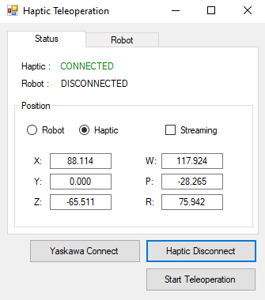

# YASKAWA-Robot-Teleoperation

An interface to control a YASKAWA GP7-YRC1000 industrial robotic arm through a teleoperation method. This project uses a 3DS Haptic Teleoperation device to control the robot. 




## Driver Installation

If you are fisrt time using haptic, you need to install the haptic driver and the OpenHaptic plugin for C++. Find the driver in the link below.

Open Haptic 3.4 : https://support.3dsystems.com/s/article/OpenHaptics-for-Windows-Developer-Edition-v34?language=en_US

3DS Haptic Driver: https://support.3dsystems.com/s/article/Haptic-Device-Drivers?language=en_US

## Project configuration

The program is written in `Visual Studio 2019 C++`. However, we need to install Visual Studio 2010 since the haptic driver only supports the v100 platform toolset. 


1. Select the project configuration as `Release` and the platform `x86`. 

2. Open the `Project`⮕`Properties`. In `General` set the properties as follow:
   * `Platform Toolset` : Visual Studio 2010 (v100)
   * `Use of MFC` : Use MFC in a Shared DLL
   * `Character Set` : Use Multi-Byte Character Set


2. Next go to `C/C++` --> `General`, under the `Additional Include Directories` add the these following path to your OpenHaptic include.
   * C:\OpenHaptics\Developer\3.4.0\utilities\include
   * C:\OpenHaptics\Developer\3.4.0\Quickhaptics\header
   * C:\OpenHaptics\Developer\3.4.0\include
   
3. After that go to `Linker` --> `General` and under the `Additional Library Directories` add the libs directory:
   * C:\OpenHaptics\Developer\3.4.0\utilities\lib\Win32\Release
   * C:\OpenHaptics\Developer\3.4.0\Quickhaptics\lib\Win32\Release
   * C:\OpenHaptics\Developer\3.4.0\lib\Win32\Release
 
4. We also need to specify the name of the lib files. Under the `Linker` select `Input` and then add the following lib files.
    ```
    hd.lib
    hdu.lib
    hl.lib
    ws2_32.lib
    ```
  
